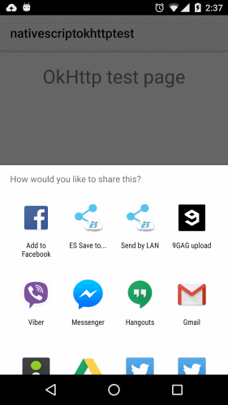
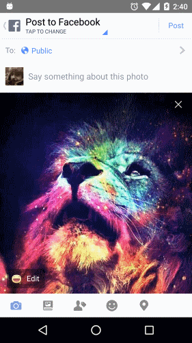

# NativeScript plugin for OkHttp

[`OkHttp`](http://square.github.io/okhttp/) is an HTTP client that supports:

- HTTP/2 and SPDY support allows all requests to the same host to share a socket.
- Connection pooling reduces request latency (if SPDY isn’t available).
- Transparent GZIP shrinks download sizes.
- Response caching avoids the network completely for repeat requests.


# Installation

Run the following command from the root of your project:

```
$ tns plugin add nativescript-okhttp
```

This command automatically installs the necessary files, as well as stores nativescript-okhttp as a dependency in your project's `package.json` file.

# Usage

To use the social share module you must first `require()` it. After you `require()` the module you have access to its APIs.

``` js
var okHttp = require("nativescript-okhttp");
```

# API

### getString(url)

The `getString()` method downloads a URL as a string.

``` js
var okHttp = require("nativescript-okhttp");
function pageLoaded(args) {
    var result = okHttp.getString("http://www.google.com/");
    console.log(result);
}
exports.pageLoaded = pageLoaded;
```
### getJSON(url)

The `getString()` method downloads a URL as a string.

``` js
var okHttp = require("nativescript-okhttp");
function pageLoaded(args) {
    var json = okHttp.getJSON("https://api.github.com/gists/c2a7c39532239ff261be");
    console.log("JSON url: " + json.url);
}
exports.pageLoaded = pageLoaded;
```
### getImage(url)

The `getImage()` method returns an image as a stream from a remote URL.

In this example, we will download an image from umgur (http://i.imgur.com/sXG9IHW.jpg) and we will share it ot Facebook using a social share plugin (https://github.com/tjvantoll/nativescript-social-share).


``` js
var socialShare = require("nativescript-social-share");
var imageSource = require("image-source");
var okHttp = require("nativescript-okhttp");
function pageLoaded(args) {
    var inputStream = okHttp.getImage("http://i.imgur.com/sXG9IHW.jpg");
    var image = imageSource.fromData(inputStream);
    socialShare.shareImage(image);
}
exports.pageLoaded = pageLoaded;
```




